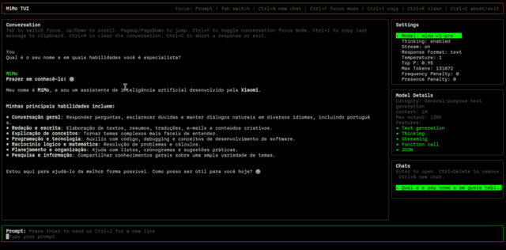

# MiMo TUI

  

TypeScript terminal UI for chatting with MiMo models through Xiaomi's OpenAI-compatible API.

## Screenshot



## Features

- Interactive terminal chat UI built with `Ink`
- Support for `mimo-v2-flash`, `mimo-v2-pro`, `mimo-v2-omni`, and `mimo-v2-tts`
- Real-time streaming responses
- `Markdown` rendering inside the `Conversation` panel
- `Syntax highlighting` for code blocks
- Manual scrolling in `Conversation`
- SQLite-backed persistent chat history with multiple conversations
- Open previous chats from the `Chats` sidebar, create a new chat, and delete saved chats
- Copy the last response to the clipboard
- Conversation focus mode for easier reading and mouse selection
- TTS generation in `mp3` or `wav`
- Audio files saved to the system home directory with a clickable path for playback

## Requirements

- Node.js 22.5+
- A valid MiMo API key

## How to create a MiMo API key

- Go to:
  [https://platform.xiaomimimo.com](https://platform.xiaomimimo.com)

- Click `Get API key`

- Click `Sign in with Google`, or click `Sign up` with your email and password

- Accept the options, create a password, and click `Create API Key`

## Install

Install globally:

```bash
npm install -g @titenq/mimo-tui
```

## Configure the API key

Create a file named `config.json` with the following content:

```json
{
  "mimo_api_key": "your_api_key_here"
}
```

Save this `config.json` in one of these paths:

- Linux: `~/.config/mimo/config.json`
- macOS: `~/Library/Application Support/mimo/config.json`
- Windows: `C:\Users\<your-user>\AppData\Roaming\mimo\config.json`

When the app starts and the config file does not exist or is invalid, the TUI opens an API key setup screen. From there the user can:

- press `E` to type or paste the API key and save the JSON file automatically
- create the file manually and press `R` to reload
- press `Q` to quit

## Run

Run the globally installed command:

```bash
mimo-tui
```

Or run without global installation:

```bash
npx @titenq/mimo-tui
```

## How the TUI works

### Layout

- `MiMo TUI`: top bar with current focus and main shortcuts
- `Conversation`: main panel for prompts, responses, Markdown, and scrolling
- `Settings`: controls for the active model
- `Model Details`: model category, context length, max output, and features
- `Chats`: persisted chat history
- `Prompt`: multiline input area

### Supported models

- `mimo-v2-flash`
- `mimo-v2-pro`
- `mimo-v2-omni`
- `mimo-v2-tts`

## Chat features

- Conversation history is stored in SQLite in the user app data directory
- The app loads the most recent chat on startup
- Persisted context is injected back into the system prompt to restore continuity
- The `Chats` panel shows recent chats in its own viewport
- When there are more chats than visible space, `↑ More above` and `↓ More below` are shown

## TTS features

When `mimo-v2-tts` is selected:

- the TUI automatically starts a new chat
- the prompt placeholder switches to TTS input text
- TTS chats are not persisted in history
- generated audio is saved to the user's home directory
- the file path is shown in `Conversation`

### TTS defaults

- `Response Format`: `mp3`
- `Voice`: `default_en`

### Available TTS voices

- `mimo_default`
- `default_en`
- `default_zh`

TTS works best with English text.

### TTS output formats

- `mp3`
- `wav`
- `pcm16` when `stream` is enabled

## Shortcuts

### Global

- `Tab`: switch focus between panels
- `Ctrl+C`: abort the current response or exit the app
- `Ctrl+N`: start a new chat
- `Ctrl+F`: toggle conversation focus mode
- `Ctrl+Y`: copy the last response to the clipboard
- `Ctrl+R`: clear the current conversation

### Prompt

- `Enter`: send the current message
- `Ctrl+J`: insert a new line
- `Left / Right`: move the cursor
- `Home / End`: jump to the beginning or end
- `Backspace`: delete backward
- `Ctrl+D`: delete forward
- pasting multiple lines automatically expands the prompt box

### Conversation

- `Up / Down`: scroll by line
- `PageUp / PageDown`: scroll by page

### Chats

- `Enter`: open the selected chat
- `Ctrl+Delete`: delete the selected chat

## Clipboard

`Ctrl+Y` copies the last MiMo response using `clipboardy`.

## Notes

- TTS only uses the voices currently accepted by this API integration
- The audio file path is shown in `Conversation` with visual highlighting
- Click behavior for the file path may vary depending on your terminal or IDE

## Development

Install dependencies for local development:

```bash
npm install
```

For local development, create a `.env` file at the project root with:

```env
MIMO_API_KEY=your_api_key_here
```

Run in development:

```bash
npm run dev
```

Watch mode:

```bash
npm run dev:watch
```

Build:

```bash
npm run build
```

Run the compiled build:

```bash
npm run start
```

Quality checks:

```bash
npm run lint
```

Run only type-checking:

```bash
npm run type-check
```

## Main stack

- `TypeScript`
- `React`
- `Ink`
- `marked`
- `cli-highlight`
- `clipboardy`
- `node:sqlite`

## License

Distributed under `GPL-3.0`. See `LICENSE.txt`.

<!-- Stargazers generated automatically with npx @titenq/stargazers -->

## ⭐ Stargazers

This repository has no stargazers yet. Be the first!
